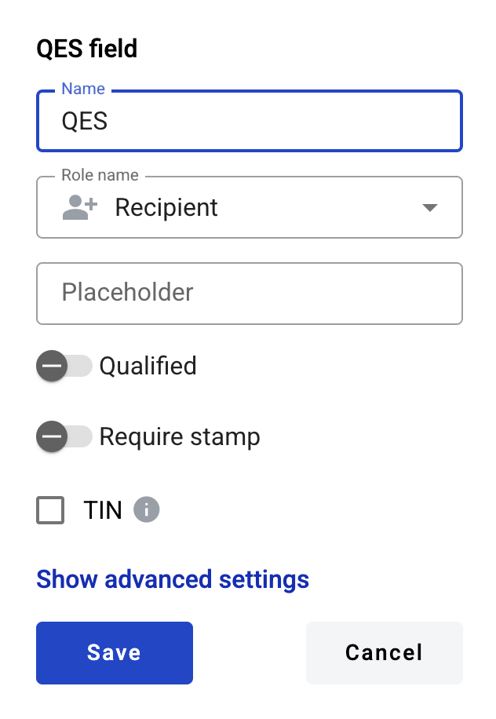

=========
QES field
=========

This field allows you to place an QES signature on the document.

.. hint:: This field can be added to any type of the document.

How to add a QES field to the document?
=======================================

1. To add field to the document, use one of field adding methods with field icon in the Fields tab of template editor menu

2. Field creation form will appear, where you should set field attributes

3. Name - this is a name of a field
4. Role name - this is a role which will be assgined to fill this field
5. Placeholder - this text will be shown inside the field before it is filled in (can be left empty; field`s name will be used instead)
6. Qualified - this attribute specifies if signature will be qualified
7. Required stamp - this attribute specifies if stamp will be required for signing
8. TIN (becomes editable if there are other fields in the template) - this attribute restricts signing process for everyone except a person with TIN code specified in field selected below
9. Document (appears if TIN is enabled) - document where TIN field is placed
10. TIN field (appears if TIN is enabled) - field which will be used for TIN check

This field also includes additional attributes, which you can access by clicking the "Show advanced settings" button.

11. Tooltip — enables adding a custom tooltip that will be displayed for active fields in the envelope. If left blank, the default tooltip is shown

When all attributes are set, you can click Save button and field will be added. You can click field to see its properties and update them. Also you can delete the field in same menu.
Please note that the “Show advanced settings” option is available only when you add a field. In edit mode, all existing attributes of the field are displayed.

**Content list**

.. toctree::

   envelope/digitalSignatureOnEnvelope.rst
   download/downloadTheSignedData.rst
   listingPage/digitalMassSigningOfEnvelopes.rst