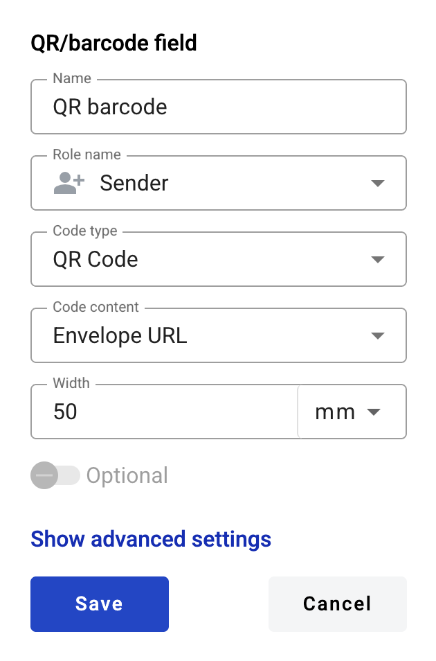
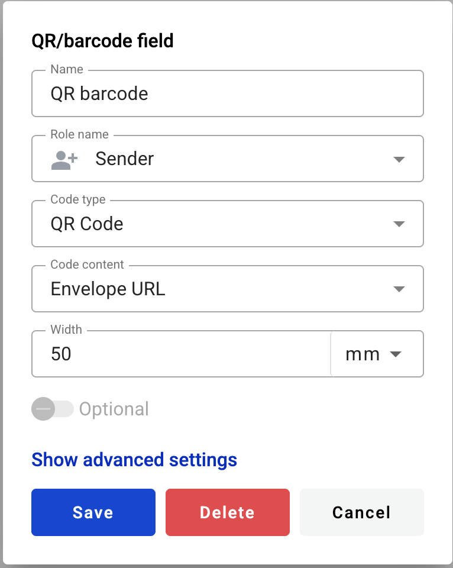

================
QR/barcode field
================

This field allows you to create QR and barcodes of different types.

.. hint:: This field can be added to structured and PDF documents.

How to add a QR/barcode field to the document?
==============================================

1. To add field to the document, use one of field adding methods with field icon in the Fields tab of template editor menu

2. Field creation form will appear, where you should set field attributes

3. Name - this is a name of a field
4. Role name - this is a role which will be assigned to fill this field
5. Code type - this attributes specifies a type of QR or barcode which will be used
6. Code content - this attribute specifies if the code will be automatically generated and will contain the URL of the envelope or if it will be possible for envelope processing flow participants to fill the code with custom data

.. note:: Most of 1D code types (barcodes) support limited amount and types of characters. Envelope URL code content is not available for such code types.

7. Width - this attribute specifies the code width in pixels (automatically populated with default width of selected code type)

.. note:: You can select unit of measure for code width - millimeters or percentage of document width.

8. Optional (becomes editable if data code content is selected) - this attribute specifies if this field is mandatory to fill

This field also includes additional attributes, which you can access by clicking the "Show advanced settings" button.

9. Tooltip - enables adding a custom tooltip that will be displayed for active fields in the envelope. If left blank, the default tooltip is shown

When all attributes are set, you can click the "Save" button and the field will be added. You can click the field to view or update its properties, and also delete it in the same menu.

Please note that the "Show advanced settings" option is available only while no additional attributes have been added to the field.
Once at least one additional attribute is added — either during creation or later in edit mode — this option will no longer appear, and all available attributes will be displayed for editing instead.

