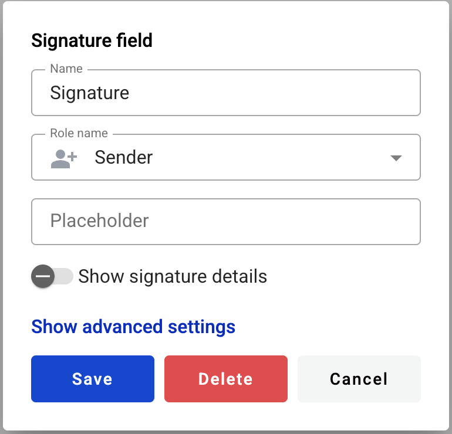
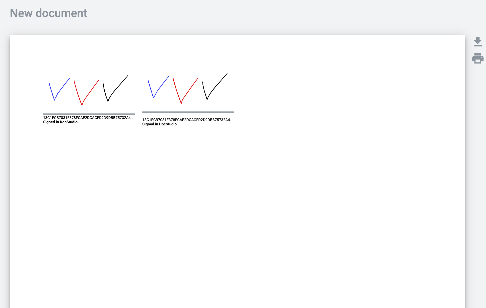
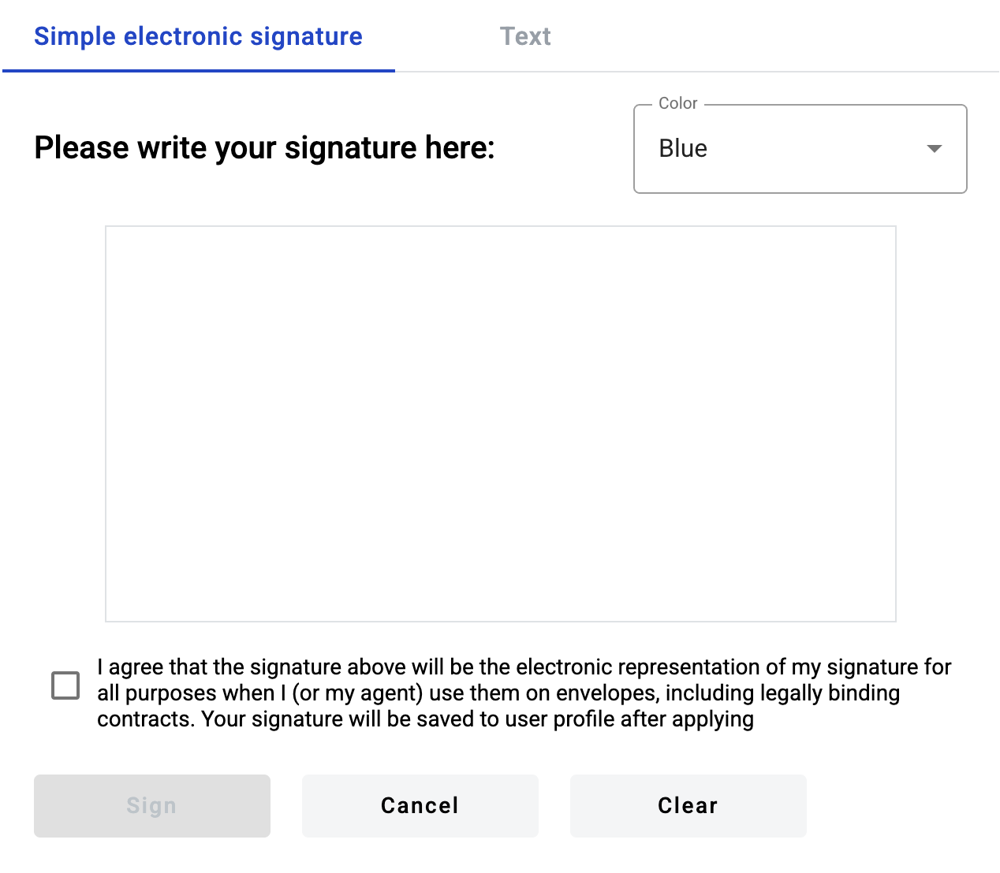
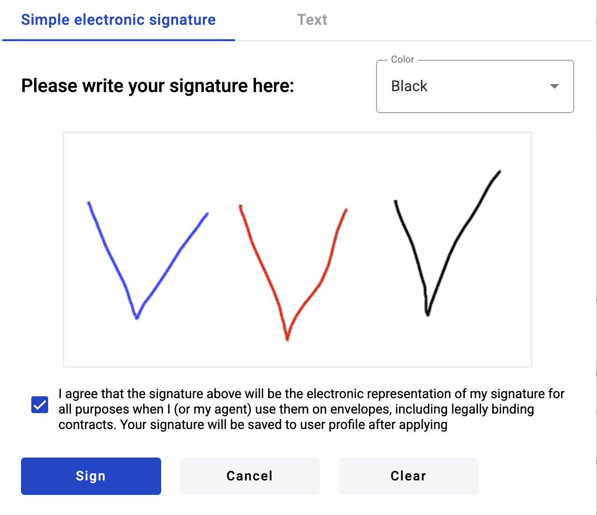

===============
Signature field
===============

This field allows you to place an e-ink signature on the document.

.. hint:: This field can be added to structured and PDF documents. If added to external document, it will be converted to PDF automatically.

How to add a signature field to the document?
=============================================

1. To add field to the document, use one of field adding methods with field icon in the Fields tab of template editor menu

2. Field creation form will appear, where you should set field attributes

3. Name - this is a name of a field
4. Role name - this is a role which will be assgined to fill this field
5. Placeholder - this text will be shown inside the field before it is filled in (can be left empty; field`s name will be used instead)
6. Show signature details - displaying signature details on the envelope. If enabled, there will be the date, mailbox or email address of the signer, signature hash, and 'Signed by [instance name]'. If disabled, only the signature hash and and 'Signed by [instance name]' will be shown

This field also includes additional attributes, which you can access by clicking the "Show advanced settings" button.

7. Tooltip - enables adding a custom tooltip that will be displayed for active fields in the envelope. If left blank, the default tooltip is shown

When all attributes are set, you can click the "Save" button and the field will be added. You can click the field to view or update its properties, and also delete it in the same menu.

Please note that the "Show advanced settings" option is available only while no additional attributes have been added to the field.
Once at least one additional attribute is added — either during creation or later in edit mode — this option will no longer appear, and all available attributes will be displayed for editing instead.

.. _simpleElectronicSignature:

How to fill a signature field in the envelope?
==============================================

1. Open envelope where signature field is located
2. Click the signature field

3. A modal window will appear

.. note:: If you have saved e-ink signature in your profile settings page, window will not open and signature will be automatically applied.

4. Draw your signature on the empty area by pressing left side on the mouse and dragging it around. You have to draw at least 0.5 sec to complete validation of the field. Note that you can change color or input text instead of drawing on Text tab. 

5. You can reset drawing area with "Clear" button
6. A text version of the signature can also be created. To do this, go to the Text tab in the open window.

.. note:: To accept the created signature, you must select the checkbox "I agree that the signature above will be the electronic representation of my signature for all purposes when I (or my agent) use it on envelopes, including legally binding contracts. Your signature will be saved to your user profile after applying". 
   If you create a new signature that is different from the one previously set in your profile, saving it will also update the signature in your user profile.

6. Click "Sign" to insert your signature to the field (can't be empty) and you will see your signature in the document
7. Under the signature, you will see its details, depending on whether the "Show signature details" toggle was enabled or not on the template

.. note:: If toggle was enabled - there will be displayed signature hash and 'Signed by [instance name]' and reserved space for date and email address of the signer (it will appear on the document after sending the envelope). If toggle was disabled there will be just signature hash and 'Signed by [instance name]'. 

.. note:: Please note that the signature date will be set according to the signer's timezone and 'Signed by [instance name]' will by displayed in the default language of the instance.

8. Signature can be changed by clicking the picture of your signature and repeating steps 3, 4, and 6