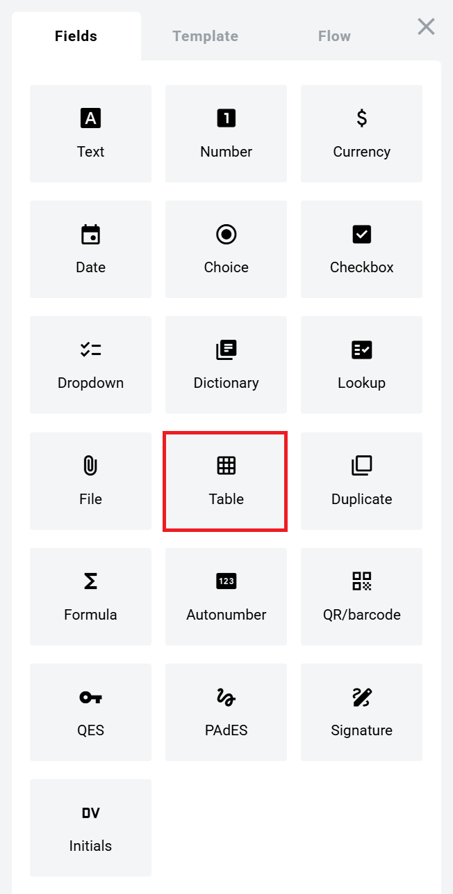
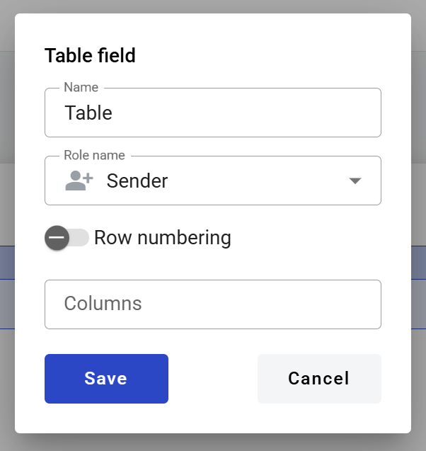
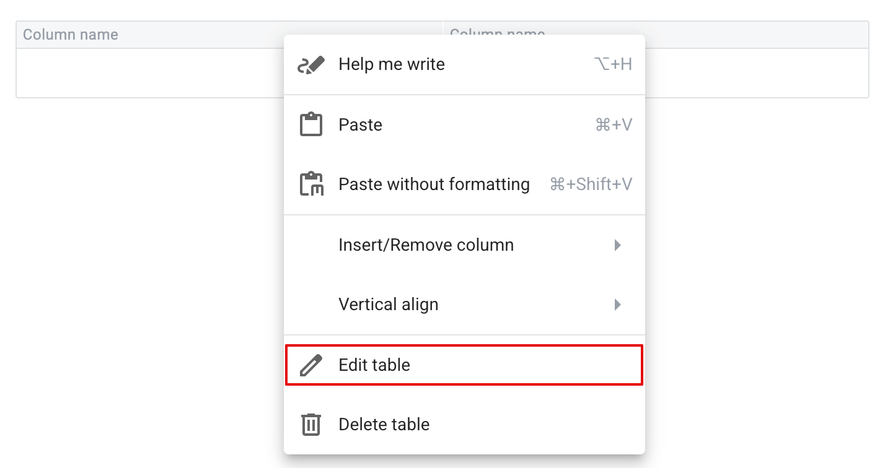
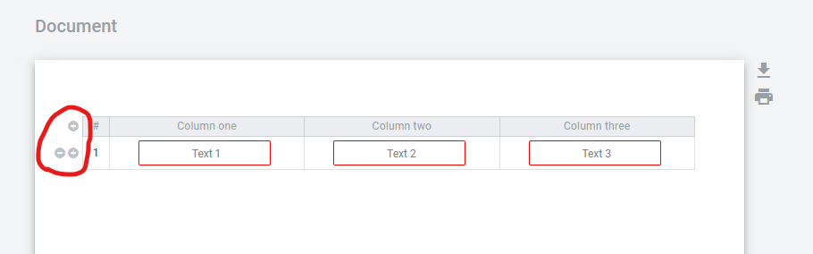
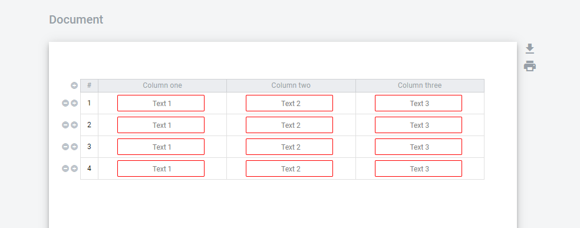

===========
Table field
===========

This field allows you to create a dynamic grid in the document, which allows to create a table of the needed size for participant of the envelope processing flow. Each table can have up to 120 columns and each column can be resized (min width is 30 pixels).

.. hint:: This field can be added to structured documents only.

How to add a table field to the document?
=========================================

1. To add field to the document, use one of field adding methods with field icon in the Fields tab of template editor menu

2. Field creation form will appear, where you should set field attributes

3. Name - this is a name of a field
4. Role name - this is a role that will be assigned to fill this field
5. Row numbering - this attribute specifies if number column will be shown in the table
6. Columns - this attribute specifies number of usable table columns

When all attributes are set, you can click the "Save" button and the field will be added. You can click the field to view or update its properties, and also delete it in the same menu.

To view and edit table properties, right-click the table and select "Edit table" from the context menu.

Table columns can be renamed and resized, table content alignment options can be accessed from table column header menu. Other dynamic fields (except dynamic table itself) can be added inside the table cells.

.. note:: If you want to hide certain columns of the table in its initial state you can click the according column, enable "Initially hidden" attribute in column properties and click "Save". Note that this is supported only for columns which have optional dynamic fields in them. Columns with static text, non-optional fields or empty cells can not be hidden. On the envelope view user will be able to show such columns from the menu on the right end of the table (only columns which have optional fields assigned for viewing user will be presented). If hidden column fields will not be filled during document processing these columns will be excluded from the final version of the document.

How to fill a table field in the envelope?
==========================================

1. Only owner of the table has management buttons to add or remove rows "+" and "-" which located at the left side of the table field

2. Each added row will be added with same fields which were added to the first row

3. When table owner added table rows and filled all mandatory fields he can send the document according to the flow. As an owner of the table he can be one of the participants of the processing flow. The rest of the participants only can input data in fields assigned to them inside the table