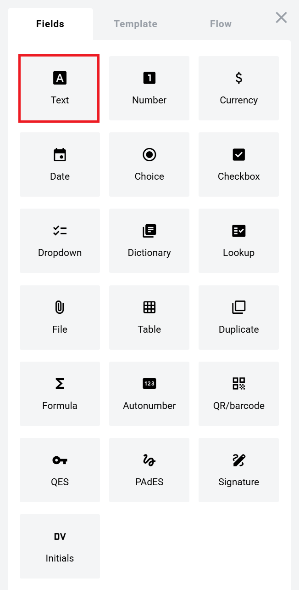
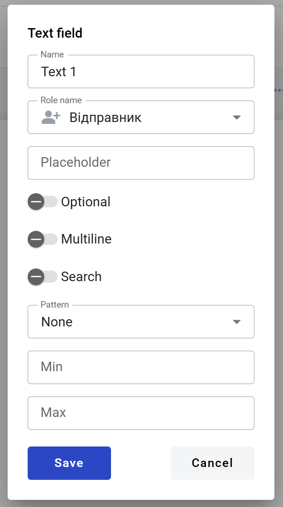
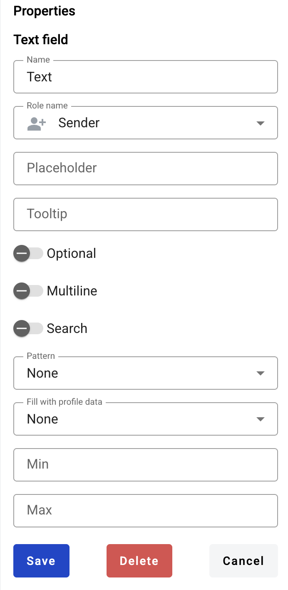

.. _textFieldTemplate:

==========
Text field
==========

This field allows you to create dynamic input box which will be filled by participants of the envelope processing flow.

.. hint:: This field can be added to structured and PDF documents.

How to add a text field to the document?
========================================

1. To add field to the document, use one of field adding methods with field icon in the Fields tab of template editor menu

2. Field creation form will appear, where you should set field attributes

3. Name - this is a name of a field
4. Role name - this is a role which will be assgined to fill this field
5. Placeholder - this text will be shown inside the field before it is filled in (can be left empty; field`s name will be used instead)
6. Optional - this attribute specifies if this field is mandatory to fill
7. Multiline - this attribute specifies is this text field will be single or multi lined

.. note:: Standart character limit is 1000 for singleline filed and 5000 for multiline field.

8. Search - this attribute specifies if this field should be eligible for mailbox page 
9. Pattern - this attribute specifies the pattern that will be applied to the field content for validation. You can select one of pattern presets or a custom option to enter your own regular expression

.. hint:: Next pattern presets are available for DocStudio and YourDoc instances: DUNS (Data Universal Numbering System), Email, Canada postal code, US ZIP code, Bank account (IBAN), Credit card number, GTIN (Global trade item number), GLN (Global location number), LEI (Legal Entity Identifier), USA EIN (Employer Identification Number), USA ITIN/SSN (Individual Taxpayer Identification Number/Social Security Number), Canadian BN (Business Number).

.. hint:: Next pattern presets are available for WhiteDoc instance: EDRPOU (Enterprise registration code in Ukraine), IPN (Identification number of the taxpayer), EDRPOU or IPN, Email, Phone number (Ukraine), Passport series and number (Ukraine), Bank account (IBAN), Credit card number, GTIN (Global trade item number), GLN (Global location number), Product article, MFO (Interbank financial code, Ukraine).

.. hint:: Custom option uses ECMAScript (JavaScript) RegEx syntax with some exceptions: lookbehinds and sticky flag are not supported, \p{L} is the only supported Unicode property escape.

10. Profile data - this attribute specifies if this field should be filled with user profile data. If you will select any available option in this field, the according user profile data will be automatically filled in this field when the envelope is opened by the user (but it will still be possible to edit it with any allowed custom value)

.. hint:: Please note that if Profile data is selected - Pattern, Min and Max attributes will be applied to this field automatically according to the selected Profile data value regardless of your input (overwritten) after the template is saved.

11. Min - minimum number of characters required for field (no limit is applied if left empty)
12. Max - maximum number of characters required for field (standart limit is applied if left empty)

When all attributes are set, you can click Save button and field will be added. You can click field to see its properties and update them. Also you can delete the field in same menu.

.. hint:: If this field contains a link in the envelope, it will be rendered a standard link in the browser (blue font with an underline). You can follow this link from the right-click context menu (any role) or directly click it (only if the field is inactive).