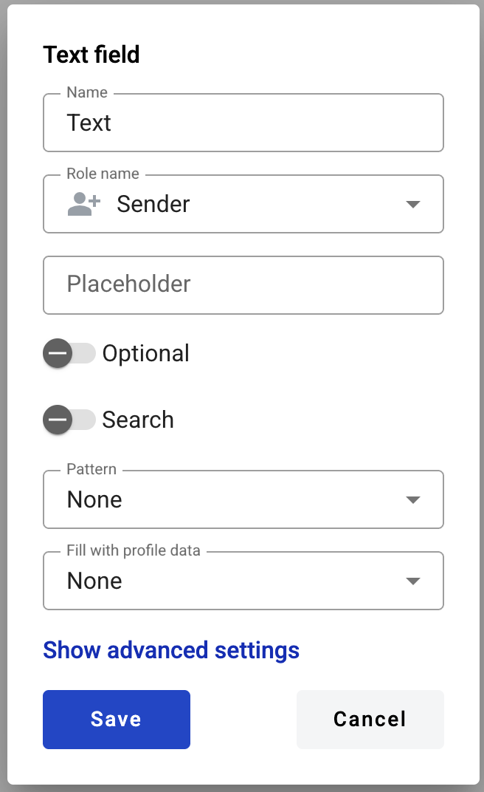
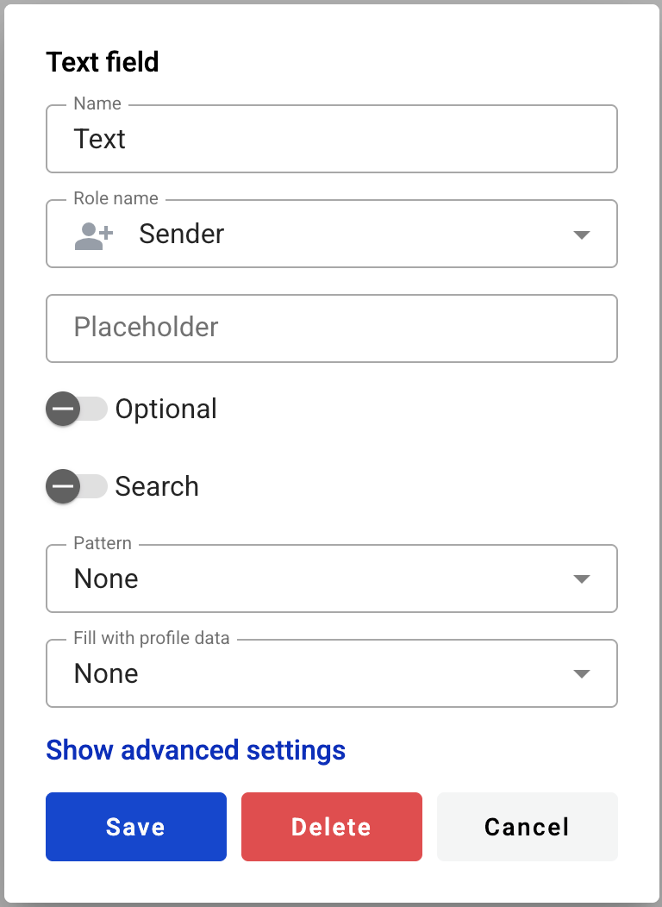

.. _textFieldTemplate:

==========
Text field
==========

This field allows you to create dynamic input box which will be filled by participants of the envelope processing flow.

.. hint:: This field can be added to structured and PDF documents.

How to add text field to the document
=====================================

1. To add field to the document, use one of field adding methods with field icon in the Fields tab of template editor menu

.. image:: pic_text/textIcon.png
   :width: 600
   :align: center

2. Field creation form will appear, where you should set field attributes

3. Name - this is a name of a field
4. Role name - this is a role which will be assgined to fill this field
5. Placeholder - this text will be shown in the input box before anything is filled in (can be left empty, field name will be used instead)
6. Optional - this attribute specifies if this field is mandatory to fill
7. Multiline - this attribute specifies is this text field will be single or multi lined

.. note:: Standart character limit is 1000 for singleline filed and 5000 for multiline field.

8. Search - this attribute specifies if this field should be eligible for mailbox page search
9. Min - minimum number of characters required for field (no limit is applied if left empty)
10. Max - maximum number of characters required for field (standart limit is applied if left empty)

When all attributes are set, you can click Save button and field will be added. You can click field to see its properties and update them. Also you can delete the field in same menu.

.. hint:: If this field contains a link in the envelope, it will be rendered a standard link in the browser (blue font with an underline). You can follow this link from the right-click context menu (any role) or directly click it (only if the field is inactive).