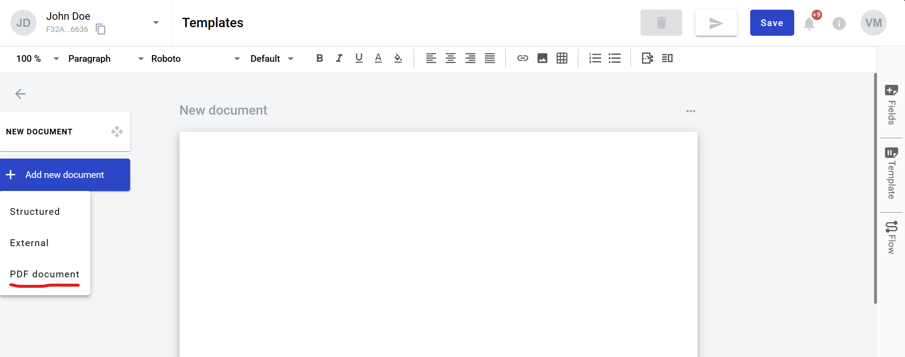

============
PDF document
============

What is a PDF document
======================

It is a PDF file upload form in the template. Also it can be left empty in template to be uploaded later by the participants of envelope processing flow. It can be signed with QES/PAdES or simple electronic signatures by envelope processing flow participants. If such document was uploaded on template level, dynamic fields can be placed on it or imported from the PDF file similar to structured document.

.. note:: Please note that maximum amount of PDF and external documents together per envelope is limited to 50 by default system configuration.

How to add a PDF document to template
=====================================

1. Click on the "Add new document" button on the left side (menu with it can be collapsed depending on your monitor resolution, just expand it by clicking "Documents" icon)

.. image:: pic_pdfDocument/newDocument.png
   :width: 600
   :align: center

2. Click on "PDF document" button. After this file explorer will open for you to select PDF file

3. You can select a file and it will be uploaded or you can close file explorer and document will be left empty for envelope processing participants to upload (assigned to Sender by default)
4. In the template editor you can edit document properties, such as role and optionality (only if no file was uploaded)
5. You also can add QES/PAdES and Signature fields to such document

How to clone a PDF document
===========================

1. Click "More" button in the right upper corner of the document
2. Click "Clone" button in the menu

How to delete a PDF document
============================

1. Click "More" button in the right upper corner of the document
2. Click "Delete" button in the menu