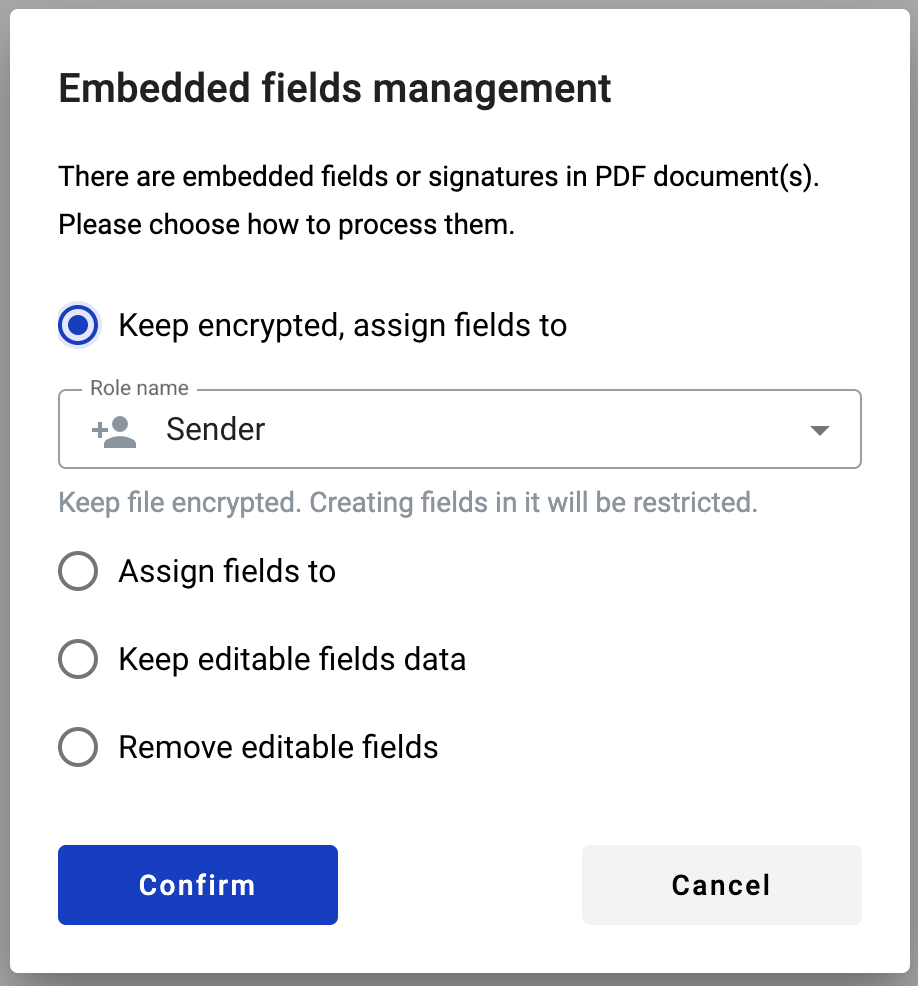

============
PDF document
============

What is a PDF document
======================

It is a PDF file upload form in the template. Also it can be left empty in template to be uploaded later by the participants of envelope processing flow. It can be signed with QES/PAdES or simple electronic signatures by envelope processing flow participants. If such document was uploaded on template level or sent via quick-send, dynamic fields can be imported from original PDF file or added manually.

.. note:: Please note that maximum amount of PDF and external documents together per envelope is limited to 50 by default system configuration.

How to add a PDF document to template
=====================================

1. Click on the "Add new document" button on the left side (menu with it can be collapsed depending on your monitor resolution, just expand it by clicking "Documents" icon)

.. image:: pic_pdfDocument/newDocument.png
   :width: 600
   :align: center

2. Click on "PDF document" button. After this file explorer will open for you to select PDF file

.. image:: pic_pdfDocument/pdf.png
   :width: 600
   :align: center

3. You can select a file and it will be uploaded or you can close file explorer and document will be left empty for envelope processing participants to upload (assigned to Sender by default)
4. In the template editor you can edit document properties, such as role and optionality (only if no file was uploaded)
5. You also can add QES/PAdES and Signature fields to such document

How to add a PDF document with embedded fields
==============================================

If PDF document contains embedded fields, you will be prompted to choose how to handle these fields upon uploading.

Depending on PDF file contents and encryption there are several upload options (only applicable options will be available for each file):

- Keep signatures and fields = Only QES/PAdES fields will be allowed to create in the document.
- Keep encrypted, assign fields to = Keep file encrypted. Creating fields in it will be restricted, except QES.
- Assign fields to = Convert dynamic fields embedded in the document into WhiteDoc fields (if existing).
- Keep editable fields data = Preserve editable fields embedded in the document in read-only state, remove signature and/or encryption. In this case all existing fields will be disabled and not converted in WhiteDoc format. New fields can be added to the document.
- Remove editable fields = Remove embedded signatures, encryption, editable fields in the document. In this case any new fields can be added to the document.

Embedded PDF fields can be converted to WhiteDoc dynamic fields. Please see conversion map below:

- Text => Text field
- Date => Text field
- Checkbox => Checkbox field
- Radio button => Choice field
- Dropdown menu => Menu field
- Listbox => Menu field
- Signature => PAdES field (only if such field type is enabled by system administrator, otherwise it will be ignored)
- Picture => currently is not supported, fields will be ignored
- Barcode => currently is not supported, fields will be ignored

.. note:: All imported fields except Choice inherit theirs optional/required attribute status from original PDF file.

How to clone a PDF document
===========================

1. Click "More" button in the right upper corner of the document
2. Click "Clone" button in the menu

How to delete a PDF document
============================

1. Click "More" button in the right upper corner of the document
2. Click "Delete" button in the menu

