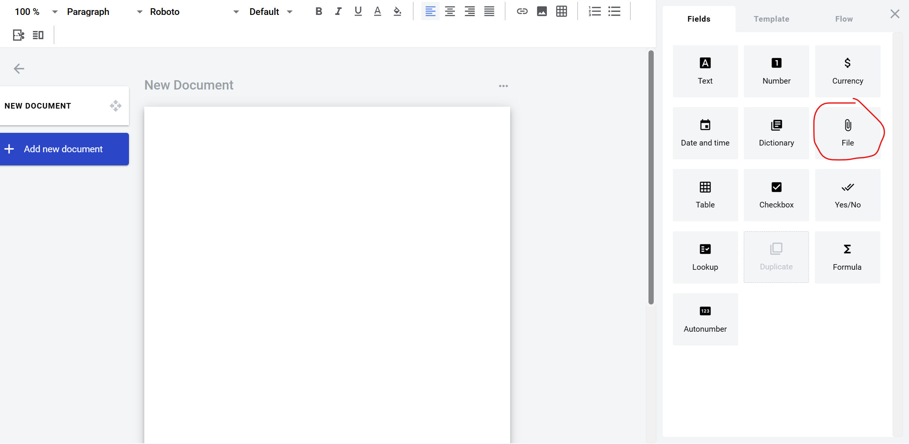
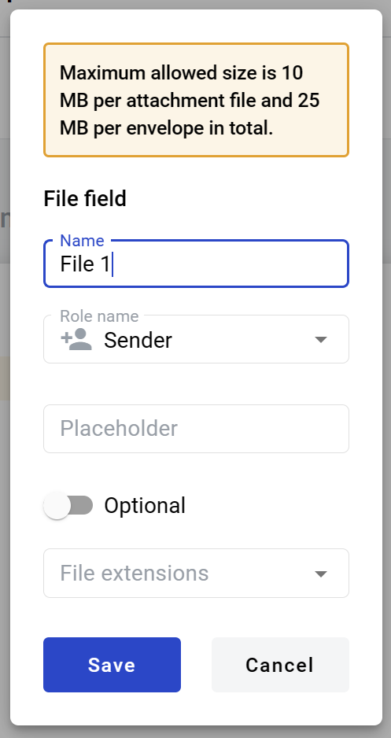
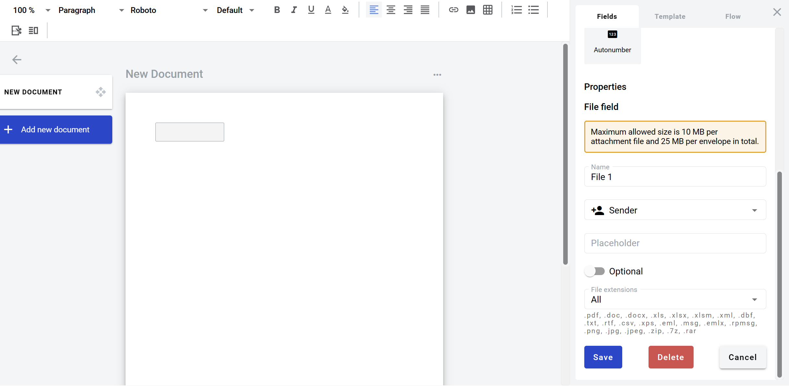

==========
File field
==========

File field allows you to create an upload box for external files. Participants of the envelope processing flow will be able to upload and download a file with it.

How to add file field to template
=================================

1. To add field to structured document, place text cursor where you want field to be added and click its button (alternatively it can be placed via drag & drop)

2. Field creation form will appear, where you should set field attributes

4. Name - this is a name of a field
5. Role name - this is a role which will be assgined to fill this field
6. Placeholder - this text will be shown in the input box before anything is filled in (can be left empty, field name will be used instead)
7. Optional - this attribute specifies if this field is mandatory to fill
8. File extension - this attribute specifies file types which will be allowed by field

.. note:: List of allowed extensions will be shown in the window after file type is selected.

When all attributes are set, you can click Save button and field will be added. You can click field to see its properties and update them. Also you can delete the field in same menu.

