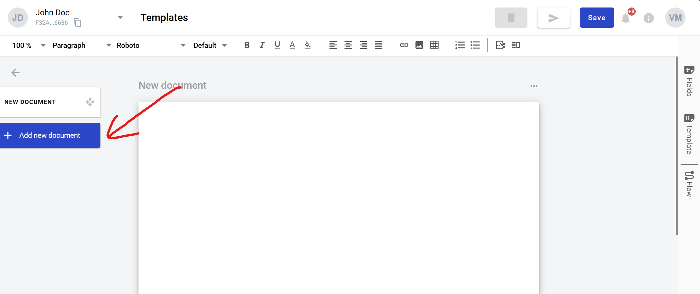
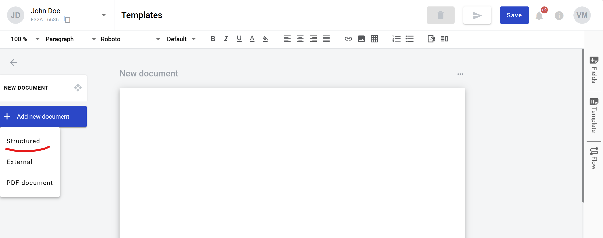

===================
Structured document
===================

What is a structured document
=============================

It is a document which you can fill in with static (simple text, tables, images and links) and dynamic (fields) data. Static data does not change from envelope to envelope, dynamic data can be modified. Structured document is added to new templates by default and additional structured documents can be added manually.

How to add a structured document?
=================================

1. Click on the "Add new document" button on the left side (menu with it can be collapsed depending on your monitor resolution, just expand it by clicking "Documents" icon)

2. Click on "Structured" button

3. New structured document is added to the template. Now you can fill it with data and add fields

How to clone a structured document
==================================

1. Click "More" button in the right upper corner of the document
2. Click "Clone" button in the menu

How to delete a structured document
===================================

1. Click "More" button in the right upper corner of the document
2. Click "Delete" button in the menu

**Content list**

.. toctree::

    linksInsideDocument/linksInsideDocument.rst
    imagesInsideDocument/imagesInsideDocument.rst
    tablesInsideDocument/tablesInsideDocument.rst