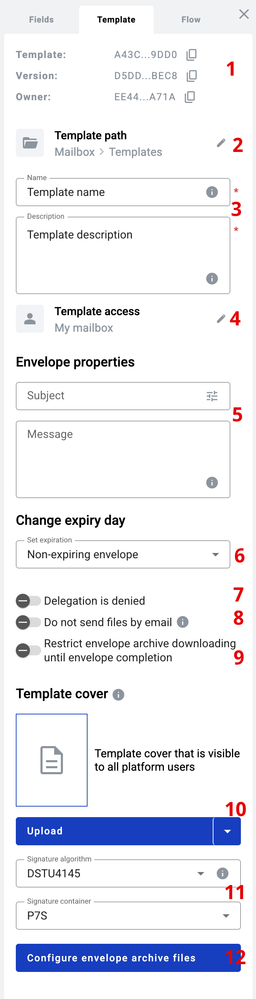

===================
What is a template?
===================

Template is an entity which can contain one or more documents inside and is used to create envelopes.

How to create template?
=======================

1. Open template list
2. Click the "New template" button
3. Fill in template subject and description in "Template" tab of right side menu (optional)
4. Configure processing flow of the template. More info on this topic can be found :ref:`here <processing-flow>`
5. Fill document with desired content and add new documents if needed
6. Click the "Save" button to save template

How to edit template?
=====================

1. Open template list
2. Click the template options icon near template you want to edit
3. Select "Edit" option from the list to open template editor
4. Now you can make you changes. To save you changes click the "Save" button in the template editor page

.. _templatePropertyTemplate:

Template properties
===================

On template configuration page you can set some template properties, such as template name, description, access level and more. On screenshot below you can find template properties description

1. Version info - appears after template is saved. Here you can find UUIDs of template, it's current version and owner mailbox

.. note:: Template version is updated in case when any changes are made to the template document contents or flow details. New version is created only after first envelope is created from the updated template.

2. Template path - this property allows you to configure template storing location across your mailboxes
3. Template name and description - these fields are mandatory to save a template
4. Template Access - property which allows you to set access level of the template according to your needs. You can read more about this functionality :ref:`here <templateAccessLevel>`
5. Envelope Properties - subject and message of envelopes created from a template. If set on template level, it's impossible to change it on envelope level later

.. note:: Advanced subject properties can be opened with properties button in Subject field. You can configure dynamic envelope auto-subject for each envelope which will include data from specified dynamic fields in the envelope. More info on this topic can be found :ref:`here <autoSubject>`.

6. Envelope expiry day - allows you to configure expiration period of envelopes created from template. If set on template level, it's impossible to change it on envelope level later
7. Envelope delegation - allows or denies delegation of the envelope. If set on template level, it's impossible to change it on envelope level later
8. Envelope sending and sharing - this property allows or denies possibility to attach documents to the envelope completion email notification or possibility to share the envelope. If set on template level, it's impossible to change it on envelope level later
9. Restrict envelope archive downloading until envelope completion  - allows you to enable or disable downloading the full envelope archive or document archives with signatures before completion at any workflow step except Draft.
10. Template cover - preview of the template that will be visible mailboxes which have access to template. Can use custom image or dynamically generate preview of first page of the template
11. These options let you configure the qualified signature:
Signature container — how the signed content is packaged for download (ASiC-E container or P7S detached file).
Signature algorithm — which cryptographic scheme is used to create the signature (DSTU 4145 or ECDSA/RSA, as required by the signer’s certificate/provider).
12. Configure envelope archive files - this feature allows you to configure an envelope archive that can be downloaded upon completion of the envelope. You can read more about this functionality :ref:`here <archiveConfiguration>`

.. toctree::

   archiveConfiguration.rst
   autoSubject.rst