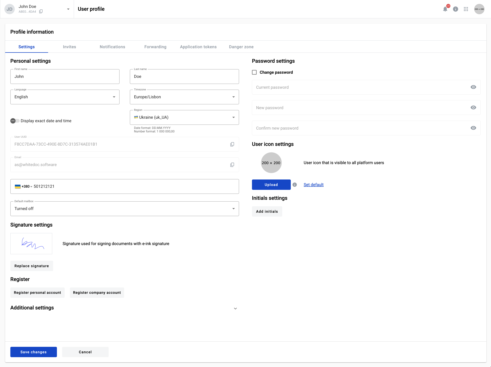
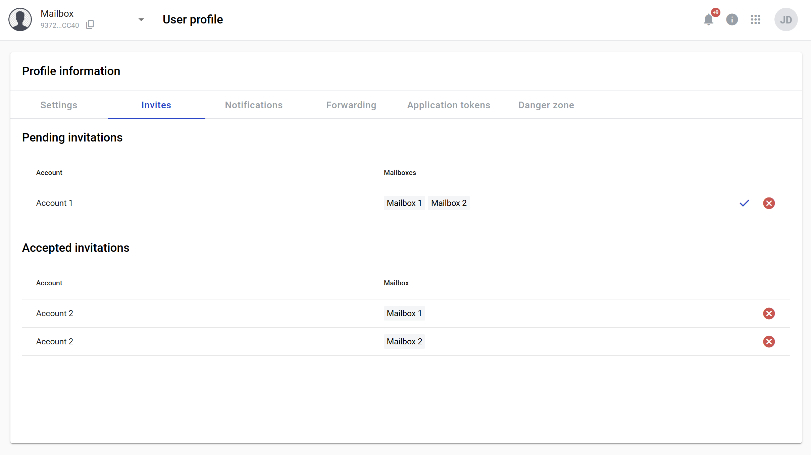

============
User profile
============

This page allows you to edit various settings of your user profile. To open user profile page navigate to https://platform_address/profile

=============
Settings page
=============

This tab contains general user profile details and info.

1. First name
2. Last name
3. Language - this is language which will be used in user interface
4. Timezone - choose your time zone
5. Display exact date - specifies if absolute (01.01.2023 12:12) or relative (fiwe minutes ago) time is used
6. Region - specifies regional formats for dates and number, example is shown below the menu
7. User UUID (can not be changed, only copied)
8. Email (can not be changed, only copied)
9. Auto deposit mailbox - specifies which mailbox will be used for incoming envelopes. If disabled - you will have to manually specify mailbox for each incoming envelope
10. Signature settings - here you can create or update your e-ink signature
11. Initials settings - here you can create or update your initials
12. Register personal account
13. Register company account

Do not forget to click the "Save changes" button after editing anything on this page.

How to create your signature?
=============================

1. Go to user profile page
2. Click the "Add signature" button (or "Replace signature" if you wish to change already existing signature)

3. Draw your signature in the opened window
4. Alternatively, text can be used for signature
5. Click the "Save changes" button on the account setting page

How to create your initials?
============================

1. Go to user profile page
2. Click the "Add initials" button (or "Replace initials" if you wish to change already existing initials)

3. Draw your initials in the opened window
4. Alternatively, text can be used for initials
5. Click on "Save changes" button on the account setting page

How to create a personal account?
=================================

1. To register new personal account click the "Register personal account" button
2. In opened window enter a name for the account
3. Select checkbox "I agree with Terms and conditions and Privacy policy"
4. Click the "Create" button (it will become active after previous steps are done)

How to create a company account?
================================

1. To register new personal account click the "Register company account" button
2. In opened window enter a name, ITN and mailbox name for the account
3. Select checkbox "I agree with Terms and conditions and Privacy policy"
4. Click the "Create" button (it will become active after previous steps are done)

How to update your password?
============================

1. Check Change password checkbox
2. Enter current password
3. Enter new password
4. Confirm new password in second field
5. Click the "Save changes" button

How to upload a user icon?
==========================

1. Click the "Upload" button and select an image
2. To see allowed image formats and sizes hover over info icon

3. Click the "Save changes" button to apply new icon
4. You can return default profile logo with "Set default" link

============
Invites page
============

This tab allows you to manage pending and accepted invitations to accounts and mailboxes from other users.

1. In the "Pending invitation" sections you can see a list of invitations from other users. Each row represents an account where you are invited to (first column). Second column shows a list of account mailboxes where you are invited to. Each invitation can be accepted or declined.
2. In the "Accepted invitation" sections you can see a list of already accepted invitations. Each row represents a mailbox (second column) where you are invited to. Accepted invitations are grouped by account (first column). Each mailbox where you accepted an invitation to can be left.

===============
Forwarding page
===============

.. note:: This functionality will be disabled if you do not have 2012 mailbox level permission (Delegate envelopes).

This tab allows you to configure automatic forwarding of all incoming envelopes.

.. image:: pic_userprofile/tabForwarding.png
   :width: 900
   :align: center

1. Select a target mailbox which will be a delegate of yours
2. Select effective from date - it will specify a start date of the forwarding period (can be left empty to start period immediately)
3. Select effective until date - it will specify an end date of the forwarding period (can be left empty to make period indefinite)
4. Enable "Active forwarding" toggle
5. Click the "Save changes" button

Forwarding is configured now. If you wish to disable it at some point later, you can disable "Active forwarding" toggle and click the "Save changes" button.

================
Danger zone page
================

.. note:: Option to remove own user profile can be restricted by instance settings. Danger zone tab will not be shown on Profile information page if so.

This tab allows you to delete your user profile.

.. image:: pic_userprofile/tabDangerZone.png
   :width: 900
   :align: center

.. warning:: After User profile deletion all Accounts with role "Account owner" will be deleted with all related data. You can keep all accounts and related data by following the insctructions below.

**Delete user profile, accounts and all related data**

1. Click the "Delete" button
2. Enter your email in upper case in the field in the modal window which opens after clicking thr "Delete" button
3. Click the "Confirm" button
4. After deletion of user profile you will be logged out and redirected to login page

**Delete user profile, but keep accounts and all related data**

1. Before deleting User profile you should assign a new account owner to all accounts where you have role Account owner role
2. After that you should go to Danger zone tab in user profile page and click the "Delete" button
3. Enter your email in upper case to the field in the modal window which opens after click the "Delete" button
4. Check "Keep the account and mailboxes" checkbox
5. Click the "Confirm" button
6. If all accounts where you have the account owner role has other owners your profile will be deleted, you will be logged out and redirected to login page. Otherwise you will see an error message in the right corner of the page

What happens with user data after deleting a user profile?
==========================================================

After user profile deletion next related data will be deleted as well:

1. Accounts where user has "Account owner" role
2. Mailboxes
3. Templates
4. Dictionaries
5. Contacts
6. Aliases
7. Envelope drafts

.. note:: Envelopes in the middle of the processing flow will not be deleted.