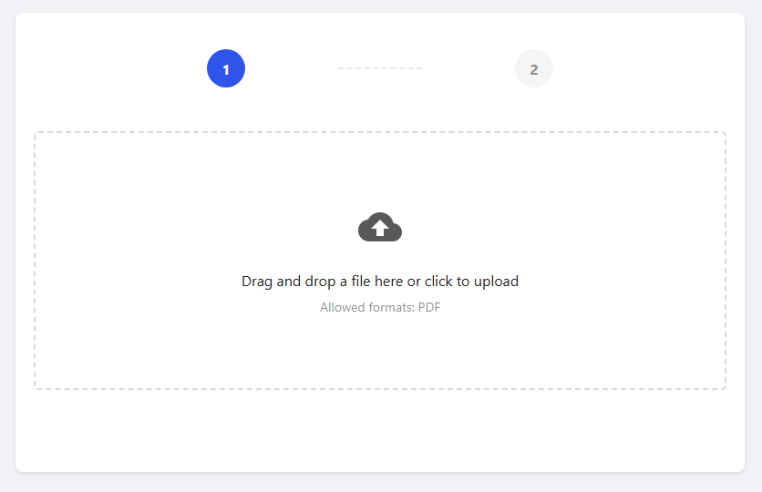
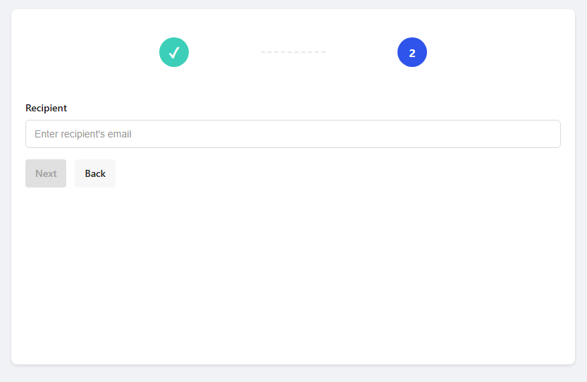
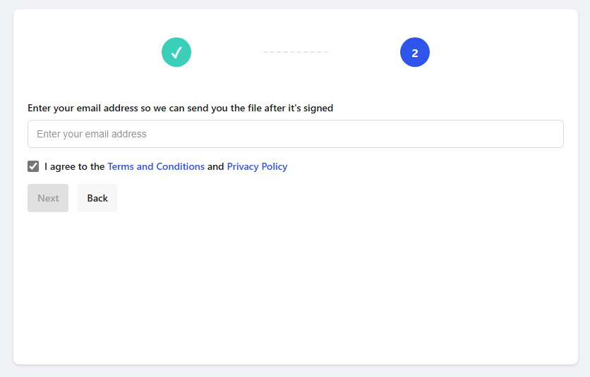
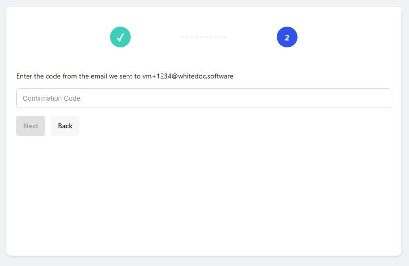
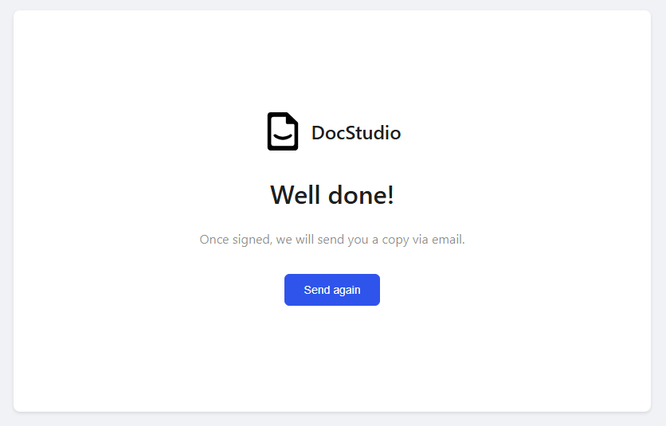

=======
Widgets
=======

On this page you can find information about our available widgets.

Simple file send widget
=======================

This widget allows anyone to send a file to be signed on our platform without needing to authorize on it. To send a file just drag & drop it onto the upload zone, or click it to select a file manually.

In the following step signers email address should be entered.

After it, senders email should be entered. Please note that this email address should not be registered on the platform.

After entering senders address, please confirm the action by entering a code that will be sent to senders email.

After a successful confirmation, envelope will be created and sent to the signer. Upon the envelope completion an email notification will be sent to the sender.

.. Tip:: Please note, that widget has a limit of 3 files per 5 minutes from one IP address to avoid spam.

To embed this widget in any web page, please do as described below:

1. Insert javascript into your webpage just after a <body> tag:

.. code-block:: javascript
    :force:
    
    
    <wd-widget base-api="https://platform_url_here/"></wd-widget>

2. Insert and style 
 where widget will be rendered
3. Insert javascript code into your webpage:
4. You can style elements of the widget since all CSS classes we use are prefixed
5. Example implementation:

.. code-block:: html

    <!DOCTYPE html>
    <html lang="uk">
    <head>
        <meta charset="UTF-8">
        <meta name="viewport" content="width=device-width, initial-scale=1.0">
        <title>Simple Send</title>
        
    </head>
    <body>
        

            <wd-widget base-api="https://platform_url_here/"></wd-widget>
        

        
    </body>
    </html>

.. Tip:: Please note the widgets min required dimensions - min-height: 504px, min-width: 350px